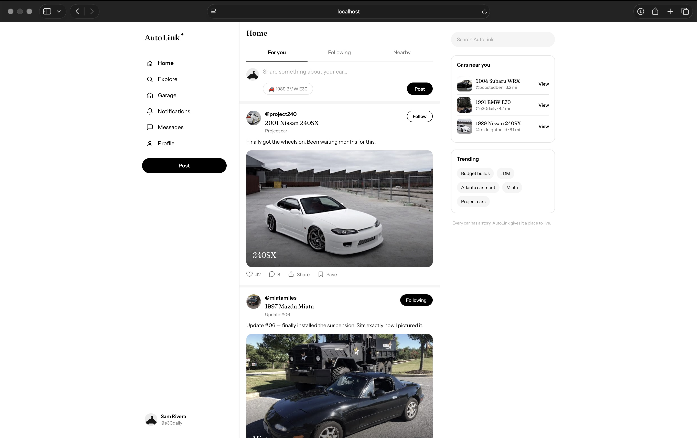
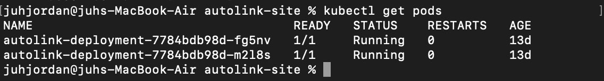

# AutoLink — Containerized App Deployment on AWS EKS



A car-focused social platform prototype I came up with, containerized with Docker and deployed to a real Kubernetes cluster on AWS EKS, all provisioned with Terraform.

I built this mainly to actually learn Docker and Kubernetes hands-on instead of just watching tutorials. The app itself isn't really the point here, it's everything underneath it: the container, the cluster, the networking.

**Stack:** Docker · Kubernetes · AWS EKS · Terraform · GitHub Actions (in progress)

## Architecture

```
Internet
   │
   ▼
AWS Load Balancer (created automatically by a Kubernetes Service)
   │
   ▼
2x EC2 Worker Nodes (t3.micro, across two subnets/AZs)
   │
   ▼
2x Pods (Deployment, replicas: 2) — each running the AutoLink container
```

## Stack Details

- Dockerfile builds the app on `nginx:alpine`
- Kubernetes Deployment (2 replicas) and Service (`type: LoadBalancer`)
- EKS cluster + node group, IAM roles, VPC, subnets, Internet Gateway, and route tables, all in Terraform
- GitHub Actions pipeline to automate build → push → deploy (in progress)

## Notes from the build

- Built the image on my Mac (Apple Silicon/arm64), but EKS nodes run on amd64, so pods just sat in `ImagePullBackOff` until I rebuilt with `docker build --platform linux/amd64`
- Fixing the platform still left me with a stuck rollout: `0/2 nodes are available: 2 Too many pods`. Old and new pods needed to run at the same time for a second and my two `t3.micro` nodes didn't have the room. Had to scale the old ReplicaSet to zero manually to free up space
- Node group failed to launch the first time I applied, turns out the default instance type wasn't Free Tier eligible on my account, fixed by setting `instance_types = ["t3.micro"]` explicitly
- Couldn't get `kubectl` to connect to a cluster I had literally just created. Apparently newer EKS versions don't automatically give the creator admin access anymore, needed `bootstrap_cluster_creator_admin_permissions = true`
- That setting can't be updated in place either, so changing it forces Terraform to destroy and recreate the whole cluster

## Testing



Checked pods were healthy with `kubectl get pods`, then grabbed the Load Balancer URL from `kubectl get services` and hit it in a browser to make sure the app was actually reachable, not just "running" on paper.

## Teardown

```
terraform destroy
```

EKS control plane and the worker nodes are what actually cost money here, so I tear it down between sessions instead of leaving it up.

## Running it yourself

Needs AWS CLI, Terraform, kubectl, and Docker installed.

```
git clone https://github.com/jdrakegit/docker-kubernetes-eks-cicd.git
cd docker-kubernetes-eks-cicd

terraform init
terraform apply
```

Point kubectl at the new cluster:

```
aws eks update-kubeconfig --region us-east-1 --name eks_cluster
```

Deploy the app:

```
kubectl apply -f deployment.yaml
kubectl apply -f service.yaml
```

Grab the public URL from `kubectl get services` once the Load Balancer finishes provisioning.

## What's next

Finishing the GitHub Actions pipeline so a push to `main` builds, pushes, and redeploys on its own, no manual steps.

---

Built by [Jordan Drake](https://github.com/jdrakegit) · [LinkedIn](https://www.linkedin.com/in/jordan-drake-a95471397)
